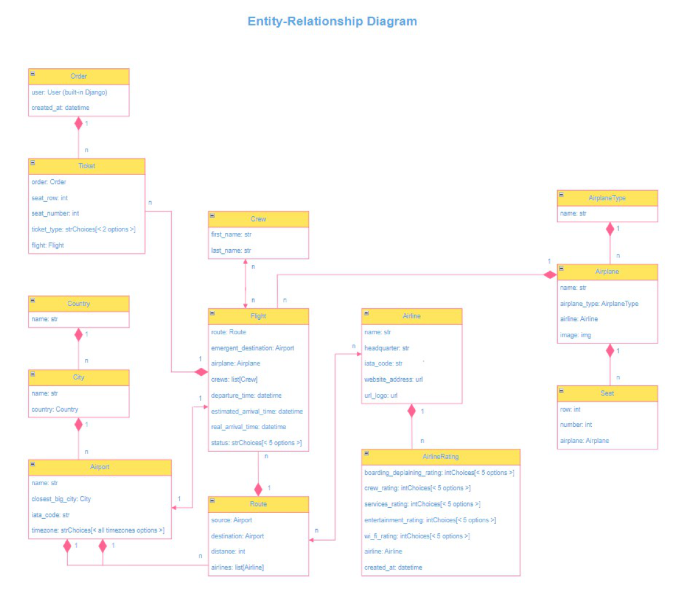
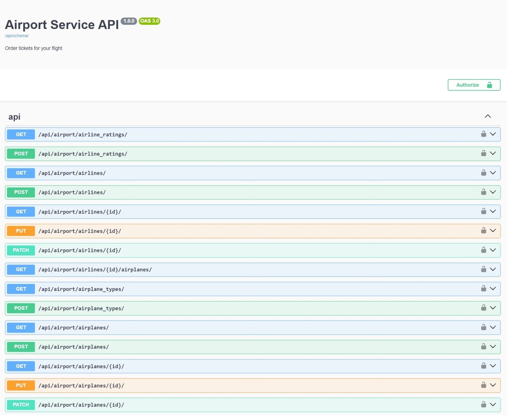
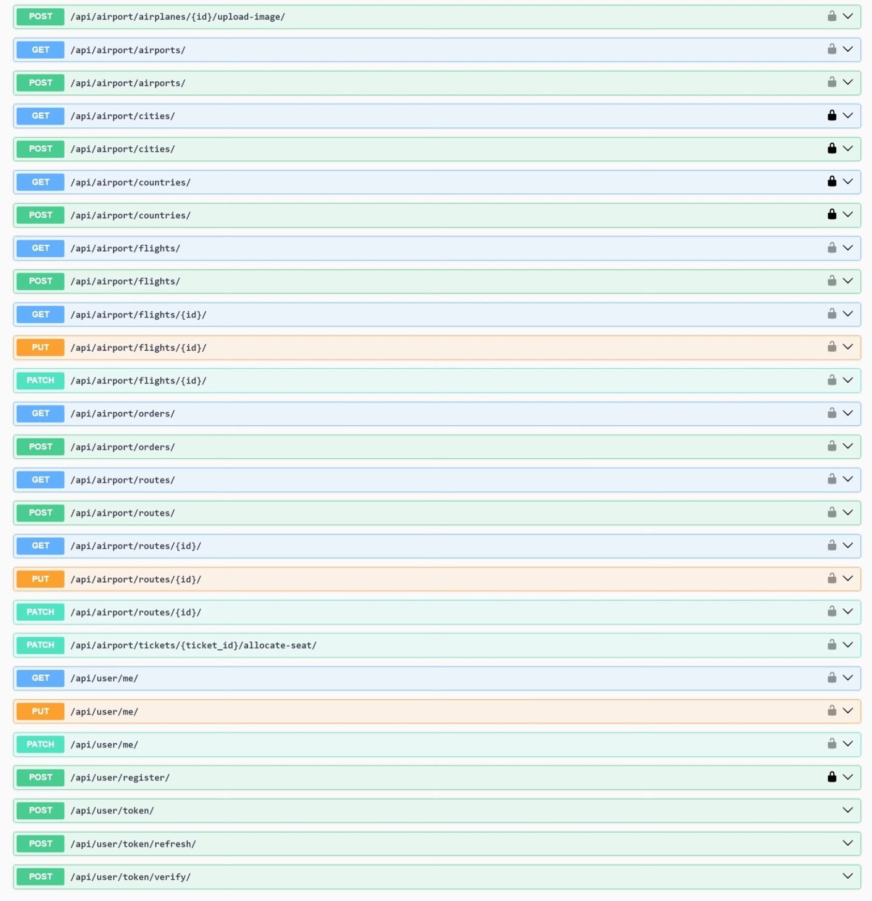

# Airport Service API

## Introduction

Welcome to the Airport Service API!
This API has been designed to track flights from airports on local, regional and global scales.

## Airport Service Features

* JWT authentication
* Admin panel /admin/
* Managing orders and tickets
* Creating routes (based on airports)
* Creating airplanes and airlines
* Creating crews
* Creating flights as complex objects
* Filtering routes by different variations of country and city
* Filtering flights by source, destination and date of the departure
* The ability to upload images to airplanes

## Installation

Clone this repository:

   ```bash
   git clone https://github.com/callogan/airport-service-api
   cd airport-service-api
   ```

* The main branch is considered as the most sustainable branch, therefore it is recommended to work from it.

* If you intend to run the application locally, follow the next steps:

1. Create the virtual environment:

   ```bash
   python -m venv venv
   ```

2. Activate the virtual environment:

   On Windows:

      ```bash
      venv\Scripts\activate
      ```

   On macOS and Linux:

      ```bash
      source venv/bin/activate
      ```

3. Install dependencies:

   ```bash
   pip install -r requirements.txt
   ```

4. Copy this file ".env.sample" and rename it to ".env", then fill in the actual values for your local environment.
5. Apply the migrations:

   ```bash
   python manage.py migrate
   ```

6. In order to run the development server, use the following command:

   ```bash
   python manage.py runserver
   ```

* You might as well run the application via the Docker. For this purpose make certain the Docker is installed 
on your computer and follow the next steps:
1. Fill the actual data for ".env" file (as was mentioned above).
2. Build the Docker image and start the containers for the application and the database:
   ```bash
   docker-compose up --build
   ```

Access the application in your web browser at http://localhost:8000.

## Project Fixture

 - This project includes the fixture that is used for demonstration purpose. The fixture contains basic dataset
representing various project entities.
 - The fixture named `airport_service_db_data.json` is located in the root directory.
 - In order to load the fixture data into the application, use the following command:

   ```bash
   python manage.py loaddata data_for_db.json
   ```

## Technologies

* [Django REST Framework](https://www.django-rest-framework.org/) This is toolbox for designing Web APIs, providing 
features such as serialization, authentication, API views and viewsets to streamline the development of RESTful services
in Django applications.
* [Docker](https://www.docker.com/) This is open source containerization platform that enables developers to package 
applications into containers, simplifying the process of building, running, managing and distributing applications 
throughout different execution environments.
* [PostgreSQL](https://www.postgresql.org/) This is a powerful, open source object-relational database management 
system.
* [Swagger](https://swagger.io/) This is open source suite of tools to generate API documentation.

Authentication of users is incorporated with means of JSON Web Tokens.

## Demo





## Copyright

Copyright (c) 2024 Ruslan Kazmiryk
